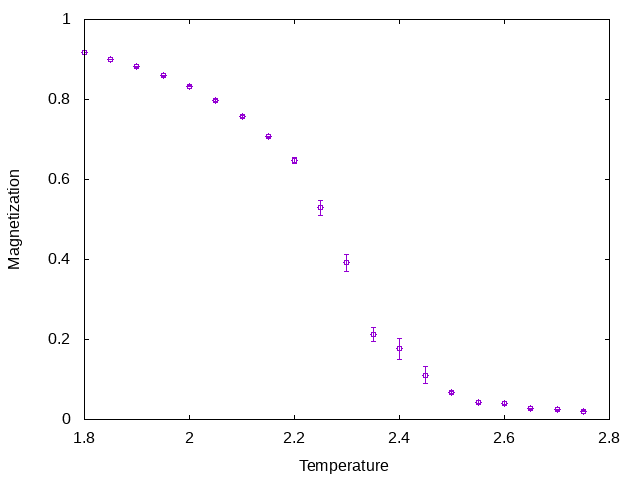
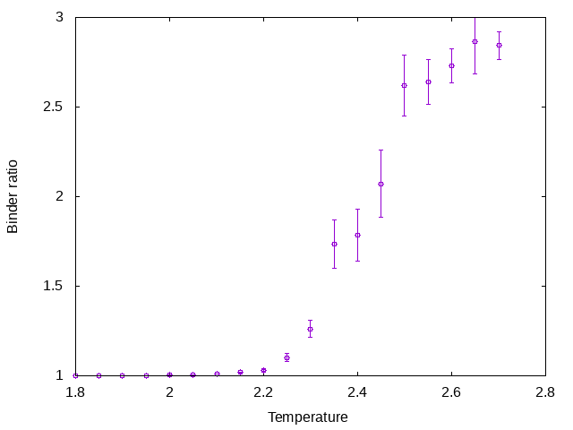
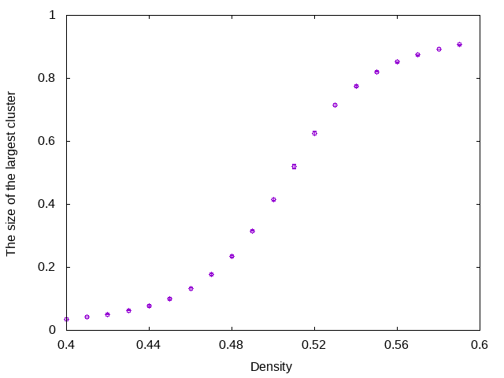
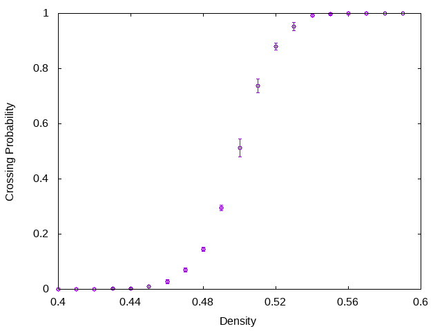

# Trivial Parallelization Scheduler

## Summary

This is a sample code for a trivial parallelization scheduler. Trivial parallelization, aka, embarrassingly parallelization is a basic technique to utilize the computational power of parallel machine.

There are two kinds of trivial parallelization. One is the parallelization of the parameter space. Suppose we study the temperature dependence of something. If the simulations at different temperatures are independent of each other, they can be performed simultaneously. The other is the parallelization of the sampling space. We usually perform the simulation with the same parameters but with different seed to estimate error bars. Of course, the runs with different seeds can be performed simultaneously.

This scheduler adopts two kinds of trivial parallelization simultaneously. Namely, we divide the processes into several groups and assign different tasks to each group.

Suppose we have 20 processes. We divide them into five groups by using `MPI_Comm_split`.

```txt
0 1 2 3 | 4 5 6 7 | 8 9 10 11 | 12 13 14 15 | 16 17 18 19
```

A different group has a different color. The four processes in a group are used for sampling, i.e., they perform simulations with the same parameters but with different seeds. Then we can estimate the error bars.

Different colors are used for parallelization on the parameter space. For example, we want to perform simulations at 20 temperature points. Then the temperatures are divided into five groups. Each temperature group is assigned to each process group.

This scheduler allows us to perform such trivial parallelization for parameters and samplings simultaneously.

## Sample for Ising Model

### Serial Run

Here is the sample for a serial run. This is a Monte Carlo simulation of the ferromagnetic Ising model on the square lattice. The spins are updated by the Metropolis method.

```cpp
#include "../tps.hpp"
#include "ising_mc.hpp"
#include <cmath>
#include <iostream>
#include <vector>

const int num_samples = 4;             // Number of Samplings at each temperatures
const int size = 32;                   // System Size
const int thermalization_loop = 10000; // Number of Loops for Thermalization
const int observation_loop = 1000;     // Number of Loops for Observation

int main(void) {
  // Tempeartures to be simulated
  std::vector<double> temperatures = {1.80, 1.85, 1.90, 1.95, 2.00, 2.05, 2.10, 2.15, 2.20, 2.25, 2.30, 2.35, 2.40, 2.45, 2.50, 2.55, 2.60, 2.65, 2.70, 2.75};
  std::vector<Params> pv;
  for (size_t i = 0; i < temperatures.size(); i++) {
    Params p;
    p.thermalization_loop = thermalization_loop;
    p.observation_loop = observation_loop;
    p.size = size;
    p.parameter = temperatures[i];
    pv.push_back(p);
  }
  tps::run(pv, ising2d, num_samples);
}
```

The function `ising2d` is the simulator. It has the folowing interface.

```cpp
std::vector<double> ising2d(const Params &p);
```

It receives parameters via `Param` structure and returns observables via `std::vector<double>`. In this case, it returns the order parameter and the Binder ratio. 

The structure `Param` must contain two fields, `parameter` and `seed`. Other fields are optional.

The scheduler `tps::run` executes the simulator for all parameter points. It samples `num_samples` times for each parameter point to estimate the error bars.

It will give us the following results.





### Parallel Run

Here is the sample code for a parallel run which is almost identical to that for the serial run.

```cpp
#include "../tps_mpi.hpp"
#include "ising_mc.hpp"
#include <cmath>
#include <iostream>
#include <mpi.h>
#include <vector>

const int num_samples = 4;             // Number of Samplings at each temperatures
const int size = 32;                   // System Size
const int thermalization_loop = 10000; // Number of Loops for Thermalization
const int observation_loop = 1000;     // Number of Loops for Observation

int main(int argc, char **argv) {
  // Tempeartures to be simulated
  std::vector<double> temperatures = {1.80, 1.85, 1.90, 1.95, 2.00, 2.05, 2.10, 2.15, 2.20, 2.25, 2.30, 2.35, 2.40, 2.45, 2.50, 2.55, 2.60, 2.65, 2.70, 2.75};
  std::vector<Params> pv;
  for (size_t i = 0; i < temperatures.size(); i++) {
    Params p;
    p.thermalization_loop = thermalization_loop;
    p.observation_loop = observation_loop;
    p.size = size;
    p.parameter = temperatures[i];
    pv.push_back(p);
  }
  MPI_Init(&argc, &argv);
  tps::run_mpi(pv, ising2d, num_samples);
  MPI_Finalize();
}
```

The interface is almost same. Here is the serial run.

```cpp
#include "../tps.hpp"

tps::run(pv, ising2d, num_samples);
```

And here is the parallel run.

```cpp
#include "../tps_mpi.hpp"

tps::run_mpi(pv, ising2d, num_samples);
```

Note that, number of procs must be multiple of num_samples. While the simulation adopts the trivial parallelization, the error bars are calculated by using `MPI_Allgather`.

Here is the benchmark on Intel(R) Xeon(R) Gold 6230 CPU @ 2.10GHz, which has 20 physical CPU cores.

```sh
$ time ./serial.out > serial.dat
real    0m16.468s
user    0m16.428s
sys     0m0.001s
```

```sh
$ time mpirun -np 40 ./mpi.out | sort -nk 1 > mpi.dat
real    0m0.891s
user    0m24.240s
sys     0m0.724s
```

The speed up is about 18.5x.

Note that, the two results are identical.

```sh
$ diff -s serial.dat mpi.dat
Files serial.dat and mpi.dat are identical
```

## Sample for Percolation

It is easy to apply this scheduler for a different model. Consider the bond-percolation on the square lattice. The simulator has the following form.

```cpp
std::vector<double> percolation2d(Params &p);
```

The key parameter is the density of the active bonds. It returns two observables, the normalized size of the largest cluster and the crossing probability.

Here is the code for the serial run.

```cpp
#include "../tps.hpp"
#include "percolation2d.hpp"
#include <vector>

const int num_samples = 4;

int main() {
  std::vector<double> densities = {0.40, 0.59, 0.41, 0.58, 0.42, 0.57, 0.43, 0.56, 0.44, 0.55, 0.45, 0.54, 0.46, 0.53, 0.47, 0.52, 0.48, 0.51, 0.49, 0.50};
  std::vector<Params> pv;
  for (size_t i = 0; i < densities.size(); i++) {
    Params p;
    p.parameter = densities[i];
    p.size = 64;
    p.seed = 1;
    p.observation_loop = 100;
    pv.push_back(p);
  }
  tps::run(pv, percolation2d, num_samples);
}
```

Note that, the densities are shuffled to avoid the load imbalance.

And here is the code for the parallel run.

```cpp
#include "../tps_mpi.hpp"
#include "percolation2d.hpp"
#include <vector>

const int num_samples = 4;

int main(int argc, char **argv) {
  std::vector<double> densities = {0.40, 0.59, 0.41, 0.58, 0.42, 0.57, 0.43, 0.56, 0.44, 0.55, 0.45, 0.54, 0.46, 0.53, 0.47, 0.52, 0.48, 0.51, 0.49, 0.50};
  std::vector<Params> pv;
  for (size_t i = 0; i < densities.size(); i++) {
    Params p;
    p.parameter = densities[i];
    p.size = 64;
    p.seed = 1;
    p.observation_loop = 100;
    pv.push_back(p);
  }
  MPI_Init(&argc, &argv);
  tps::run_mpi(pv, percolation2d, num_samples);
  MPI_Finalize();
}
```

It will give us the following results.





Here are the benchmark results.

```sh
$ time ./serial.out | sort -nk1 > serial.dat
real    0m19.653s
user    0m19.605s
sys     0m0.004s
```

```sh
$ time mpirun -np 40 ./mpi.out | sort -nk1 > mpi.dat
real    0m1.286s
user    0m29.176s
sys     0m0.791s
```

The speed up is about 15.3x which is worse than the Ising model due to the load imbalance.

## License

This software is released under the MIT License, see [LICENSE](LICENSE).
